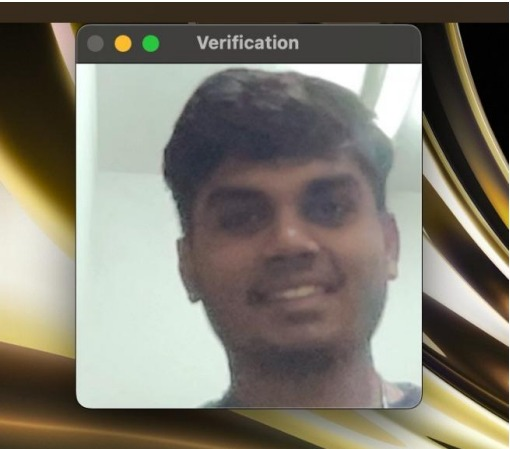
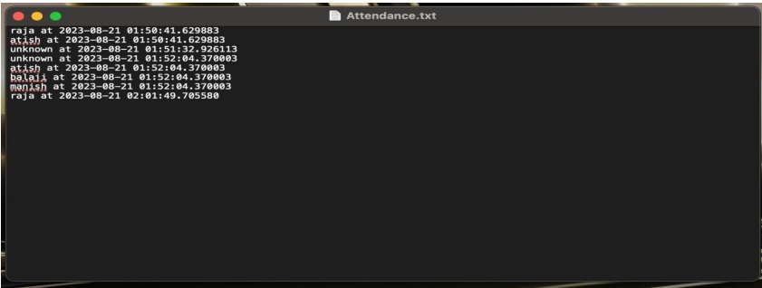

# Face Recognition Attendance System

## Overview
This project implements a Siamese Neural Network for face recognition to automate attendance marking. The system captures facial images, processes them, and verifies identities using a deep learning model. The model is trained on anchor, positive, and negative image pairs to distinguish between different individuals effectively.

## Features
- Real-time face capture using OpenCV
- Siamese Network-based face verification
- Automated attendance marking in a CSV file
- Dataset preprocessing and augmentation
- Model training, evaluation, and deployment





## Prerequisites
Ensure you have the following installed:
- Python 3.x
- TensorFlow
- OpenCV
- NumPy
- Matplotlib
- OS module
- CSV module

## Dataset Structure
The dataset consists of three types of images for each person:
- **Anchor**: The reference image of the person
- **Positive**: Another image of the same person
- **Negative**: An image of a different person

The dataset should be structured as follows:
```
dataset/
    person_1/
        anchor/
        positive/
        negative/
    person_2/
        anchor/
        positive/
        negative/
```

## Installation
1. Clone the repository:
   ```bash
   git clone https://github.com/balajirongali/Attendance-Recorder
   cd face-recognition-attendance
   ```
2. Install dependencies:
   ```bash
   pip install -r requirements.txt
   ```

## Training the Model
1. Prepare your dataset as per the structure above.
2. Run the training script:
   ```bash
   python train.py
   ```
3. The model will be trained and saved as `siamese_model.h5`.

## Running the Attendance System
1. Start the webcam verification system:
   ```bash
   python attendance.py
   ```
2. Press `v` to capture an image and verify the person.
3. If the person is recognized, their attendance is marked in `attendance.csv`.
4. Press `q` to exit.

## Model Architecture
The Siamese Network consists of:
- Convolutional layers for feature extraction
- MaxPooling layers to reduce dimensionality
- Flatten and Dense layers for embedding generation
- L1 Distance layer for similarity calculation
- Sigmoid activation for classification

## Troubleshooting
- If OpenCV fails to open the camera, check your webcam index.
- Ensure dataset folders are correctly structured.
- If training takes too long, try reducing dataset size or modifying network parameters.

## Future Improvements
- Implement a GUI for ease of use
- Optimize model for better accuracy
- Expand dataset for more robustness

## Contributors
- BALAJI RONGALI
- MANEESH KUMAR RAM RAJAVADHA
- RAJA SINGH
- AMISHA JHA
- MISBAH SHAIKH

## License
This project is open-source and available under the MIT License.

